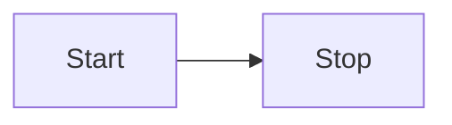

# Markdown Features

Contented [unified](https://www.npmjs.com/package/unified) processor pipeline.

```js
processor
  .use(options.before)
  .use(remarkGfm)
  .use(remarkFrontmatter)
  .use(remarkParse)
  .use(remarkLink)
  .use(remarkDirective)
  .use(remarkDirectiveRehypeCodeblockHeader)
  .use(remarkDirectiveRehypeCodeblockGroup)
  .use(remarkDirectiveRehype)
  .use(remarkFrontmatterCollect)
  .use(remarkFrontmatterResolve)
  .use(remarkFrontmatterValidate)
  .use(options.remarks)
  .use(remarkRehype)
  .use(options.rehypes)
  .use(rehypeExternalLinks, { target: '_blank' })
  .use(rehypeSlug)
  .use(rehypeAutolinkHeadings)
  .use(rehypeToc)
  .use(rehypeHeading)
  .use(rehypeMermaid)
  .use(rehypeShiki)
  .use(rehypeStringify)
  .use(options.after);
```

## GitHub Flavour Markdown

[GitHub Flavored Markdown](https://github.github.com/gfm/), often shortened as GFM, is the dialect of Markdown that is
currently supported for user content on GitHub.com and GitHub Enterprise.

This formal specification, based on the CommonMark Spec, defines the syntax and semantics of this dialect.

## Frontmatter

```markdown
---
title: Markdown Flavour
---
```

## Linking

```md
[Heading](#heading)
[External](https://example.com)

Relative Linking (manual):
[Relative Example 1](relative)
[Relative Example 2](to/folder/page-1)
[Relative Example 3](../back/page-3)

Relative Linking (automatic), give these 3 files:

1. 01-about.md
2. docs/01-introduction.md
3. docs/01-others/02-usage.md

[Automatic Relative Linking](./01-about.md):

- When you reference this link in the root dir of the pipeline `about` will be resolved.
- When you reference this link in the `docs` dir of the pipeline `../about` will be resolved.
- When you reference this link in the `docs/01-others` dir of the pipeline `../../about` will be resolved.

[Automatic Relative Linking](./docs/01-introduction.md):

- When you reference this link in the root dir of the pipeline `docs/introduction` will be resolved.
- When you reference this link in the `docs` dir of the pipeline `introduction` will be resolved.
- When you reference this link in the `docs/01-others` dir of the pipeline `../introduction` will be resolved.
```

It is highly recommended to use relative links for internal linking and avoid using absolute links.
This is because contented pipelines are designed to be portable and can be deployed to different sites or domains.
By using absolute links, you're assuming that the content will always be deployed to the same domain or the same path.
When using relative links, contented will automatically resolve the links to the correct destination.

For example:

:::codeblock-header{filename="contented.config.mjs" language="JavaScript"}

```js
/** @type {import('@contentedjs/contented').ContentedConfig} */
const config = {
  preview: {
    url: 'https://preview.contented.dev',
    name: 'Preview Contented',
  },
  processor: {
    rootDir: '../docs',
    pipelines: [
      {
        type: 'ExampleType',
        pattern: 'example-docs/**/*md',
        processor: 'md',
        transform: (file) => {
          // Notice that the path example-docs/ is removed. There is no way to know how you path is structured.
          // You need therefore use relative links that works universally across all sites.
          // This is intentional to make contented pipelines portable.
          file.path = file.path.replaceAll(/^\/example-docs\/?/g, '/');
          file.sections = file.sections.slice(1);
          return file;
        },
      },
    ],
  },
};

export default config;
```

:::

```txt
Pipeline Processed:                 -> /[path] (note docs/example-docs/ is removed)
/docs/example-docs/page-1           -> /page-1
/docs/example-docs/page-2           -> /page-2
/docs/example-docs/folder/page-3    -> /folder/page-3

Preview:                            -> https://preview.contented.dev/[type]/[path]
/page-1                             -> https://preview.contented.dev/example/page-1
/page-2                             -> https://preview.contented.dev/example/page-2
/folder/page-3                      -> https://preview.contented.dev/example/folder/page-3

Another Site:                       -> https://developer-docs.com/product-example/docs/[path]
/page-1                             -> https://developer-docs.com/product-example/docs/page-1
/page-2                             -> https://developer-docs.com/product-example/docs/page-2
/folder/page-3                      -> https://developer-docs.com/product-example/docs/folder/page-3
```

Note how "Another Site" consumed the same contented pipeline but deployed to a different domain and path with its own
custom prefix. If you used absolute links, the links would be broken.

It is also highly advised against linking to another `"Type"` as you're assuming that the other site will be
structured the same way as your site with the same prefix or even publishing that `"Type"` at all.

## Mermaid

````txt

````


````txt

````


## Directives

They can be declared via long-form `:::div{class="table-fixed"}` or short-form `:::div{.table-fixed}`

### Table Directive

| Header 1 | Header 2 | Header 3                            |
| -------- | -------- | ----------------------------------- |
| Cell 1   | Cell 2   | Cell 3 `LongTextThatCannotTruncate` |

```markdown
| Header 1 | Header 2 | Header 3                            |
| -------- | -------- | ----------------------------------- |
| Cell 1   | Cell 2   | Cell 3 `LongTextThatCannotTruncate` |
```

:::div{class="table-fixed"}
| Table Fixed | Header 2 | Header 3 |
|----------|----------|----------|
| Cell 1 | Cell 2 | Cell 3 |
:::

```markdown
:::div{class="table-fixed"}
| Table Fixed | Header 2 | Header 3 |
|----------|----------|----------|
| Cell 1 | Cell 2 | Cell 3 |
:::
```

:::div{class="table-auto"}
| Table Auto | Header 2 | Header 3 |
|----------|----------|----------|
| Cell 1 | Cell 2 | Cell 3 |
:::

```markdown
:::div{class="table-auto"}
| Table Auto | Header 2 | Header 3 |
|----------|----------|----------|
| Cell 1 | Cell 2 | Cell 3 |
:::
```

### Admonitions Directive

Admonitions with `remark-directive` and `remark-directive-rehype`.

::::div{.admonitions}
This is `div{.admonitions}`.

```markdown
:::div{.admonitions}
This is `div{.admonitions}`.
:::
```

::::

::::div{.admonitions.red}
This is `div{.admonitions.red}`.

```markdown
:::div{.admonitions.red}
This is `div{.admonitions.red}`.
:::
```

::::

::::div{.admonitions.yellow}
This is `div{.admonitions.yellow}`.

```markdown
:::div{.admonitions.yellow}
This is `div{.admonitions.yellow}`.
:::
```

::::

::::div{.admonitions.green}
This is `div{.admonitions.green}`.

```markdown
:::div{.admonitions.green}
This is `div{.admonitions.green}`.
:::
```

::::

### Codeblock Directive

#### Codeblock with Header

:::codeblock-header{filename="example.ts" language="TypeScript"}

```ts
const a: number = 1;
const b: number = 2;
```

:::

````txt
:::codeblock-header{filename="example.ts" language="TypeScript"}
```ts
const a: number = 1;
const b: number = 2;
```
:::
````

#### Codeblock with Language Selector

::::codeblock-group
:::codeblock-header{filename="example.ts" language="TypeScript"}

```ts
const a: number = 1;
const b: number = 2;
```

:::
:::codeblock-header{filename="example.js" language="JavaScript"}

```js
const a = 1;
const b = 2;
```

:::
::::

````txt
::::codeblock-group

:::codeblock-header{filename="example.ts" language="TypeScript"}
```ts
const a: number = 1;
const b: number = 2;
```
:::

:::codeblock-header{filename="example.js" language="JavaScript"}
```js
const a = 1;
const b = 2;
```
:::

::::
````

## Images

Image commonly used in Markdown is supported but with some caveats.
Contented being a prose-bundler is designed to bundle prose such that it is portable and can be deployed to different
sites or domains.
This makes it difficult to support images that are not bundled together with the prose.
To get around this, all local images are embedded into the Markdown file as base64 encoded strings.
Remote images are left as is.

> You can inspect this HTML page to see how the images are embedded.

:::div{.admonitions.yellow}

Always be careful with user input. For example, it’s possible to hide JavaScript inside images (such as GIFs, WebPs, and
SVGs). User provided images open you up to a cross-site scripting (XSS) attack.

If you’re using Contented to render user-provided Markdown, you should disable images by default and only enable them
when you trust the source. Contented designed to be used for developer authoring where the source is trusted and XSS
being the least of your worries since the developer (having control of source code) can already inject arbitrary
JavaScript into the page without needing to go through this lengthy process.

:::


```markdown


```
